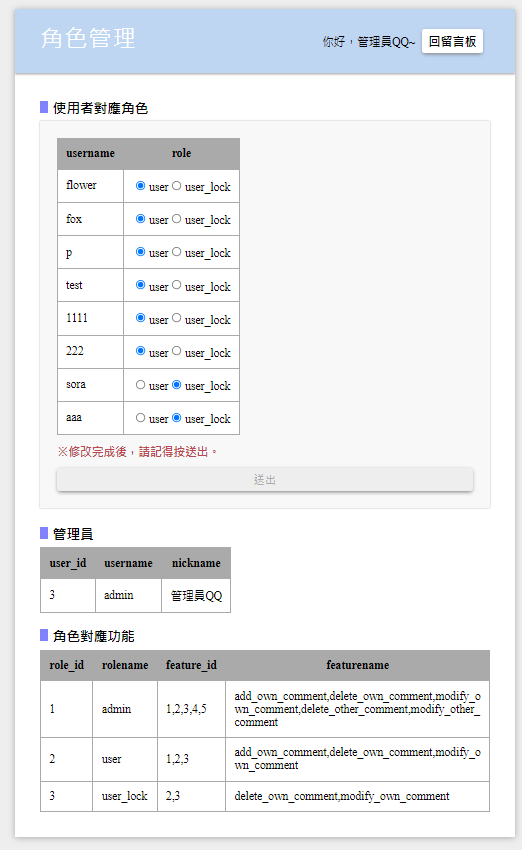
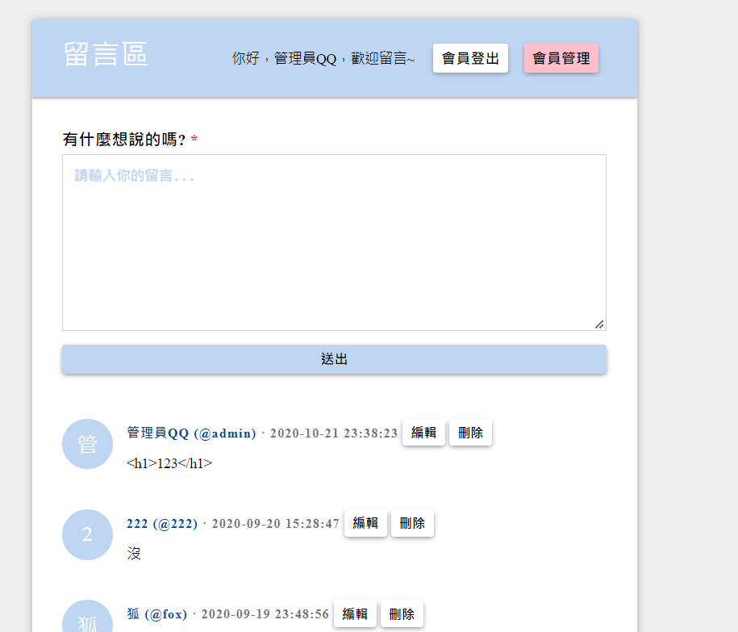
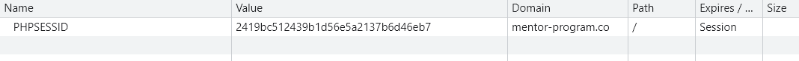
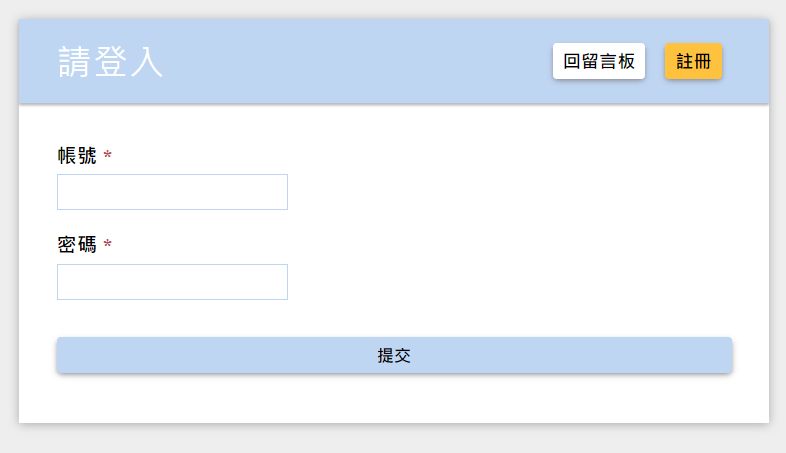
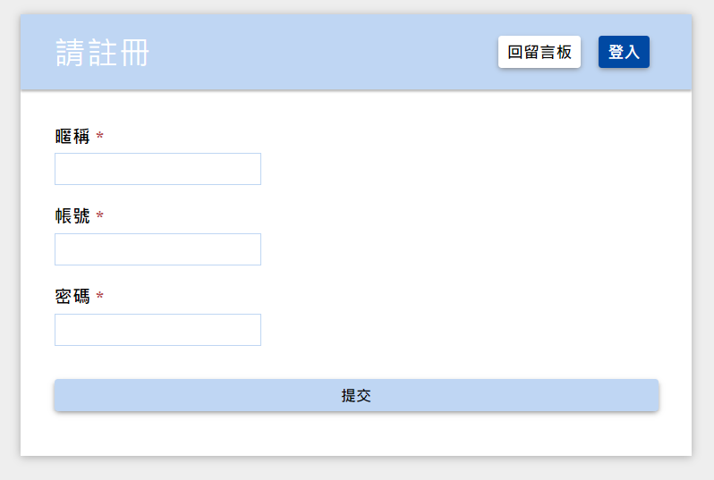
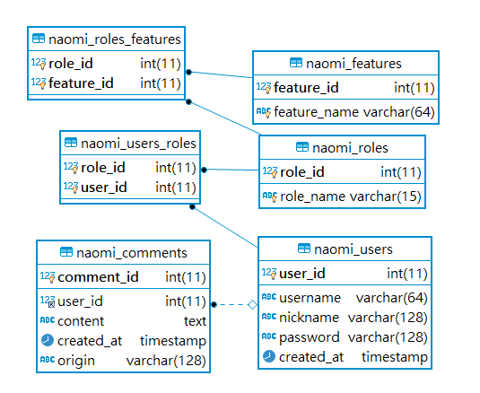
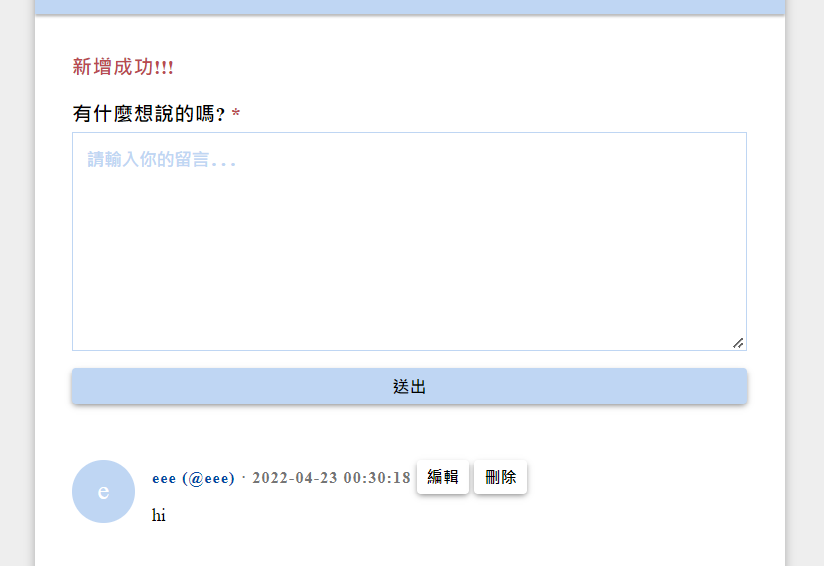
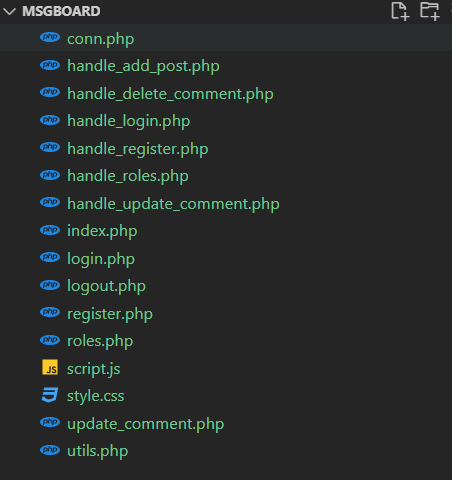
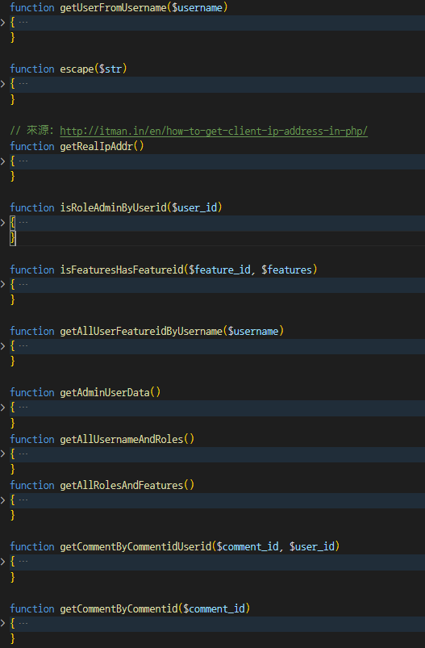
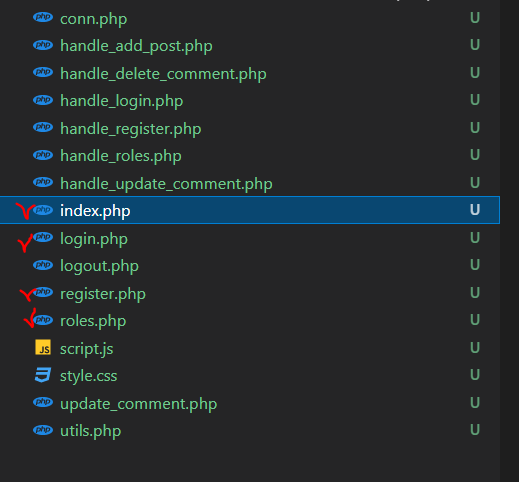

# 2020_msgboard

php 留言板

# 規格書

一個 php ssr (server side render) + mysql 的留言板

總共 3 種角色(roles): 管理員、使用者、被鎖的使用者

總共 5 種功能(features):(對自己)新增自己的留言、刪除自己的留言、編輯自己的留言、(對別人)刪除他人的留言、編輯他人的留言

透過「角色(role)」來管理「功能(feature)」的使用權限

也就是帳號根據對應角色取得使用功能的權限:

帳號 -> 角色 -> 功能

所有人要登入後才可留言，但所有人都可看到所有留言

管理者可透過 UI 設定其他人的權限，自己的權限只能透過 DB 設定



管理員登入後可看到 header 有[會員管理]按鈕


| 功能名稱                            | 權限角色                     |
| ----------------------------------- | ---------------------------- |
| add_own_comment 新增自己的留言      | 管理員、使用者               |
| delete_own_comment 刪除自己的留言   | 管理員、使用者、被鎖的使用者 |
| modify_own_comment 編輯自己的留言   | 管理員、使用者、被鎖的使用者 |
| delete_other_comment 刪除他人的留言 | 管理員                       |
| modify_other_comment 編輯他人的留言 | 管理員                       |

## 角色管理

* 使用者對應角色

  [管理員]可看到所有帳號對應的角色(role)、透過 UI 修改帳號對應的角色

* 管理員

  只能透過 DB 更改權限名稱... 等資料

* 角色對應功能

  [管理員]可以將使用者改成(user_lock)，則該帳號就不能新增留言(禁言該帳號)、但該帳還是可以修改刪除自己先前的留言。

## 登入登出

透過 cookie 管理登入資料

登入成功後會將 username 和 featuresId 存到 cookie 裡，

使用任一功能前都會先使用 cookie 內 featureId 檢查可否使用此功能(feature)

是 PHP 提供的方法，前端只會有 sessionId，前端不能自行修改 cookie 資料

除非用此 sessionId 到伺服器的某個地方找到對應的 cookie 資料，就算找到了也是加密過的，php 解密後才能看懂，所以駭客要看到 cookie 內資料很困難



```php
  // 有查到使用者
  $row = $result->fetch_assoc();
  if (password_verify($password, $row['password'])) {
    session_start();
    // 登入成功
    /*
     1. 產生 session id (token)
     2. 把 username 寫入檔案
     3. set-cookie: session-id
    */
    $_SESSION['username'] = $username;
    $_SESSION['features'] = getAllUserFeatureidByUsername($username);

    header('Location: index.php');
  } else {
    // 登入失敗 查無此人
    header('Location: login.php?errCode=2');
  }
```



## 註冊



## 欄位檢核

檢查必填欄位、跳脫字元轉換

這篇 PRD 寫超讚，可以參考來寫更仔細的 SPEC
https://www.gushiciku.cn/pl/pOFW/zh-tw

## table 設計



comments table 會記錄帳號位置的網域(origin)xD(變態)

users 和 comments table 都會記錄新增時間(created_at)

因為是 timestamp 類型，所以新增時會讓資料庫自己壓更新日期，

不用特別寫程式給時間

roles_features 和 users_roles 為多對多關聯用的表

comments 和 users 為多對一的表

先驗證(登入成功)，後授權(檢查此 user 有無該 featureId)

## 留言功能

檢核與錯誤代碼

```php
<?php
  if (empty($_SESSION['features']) || empty($user_row) || empty($_SESSION['username'])) {
    echo "<h3 class='red'>歡迎註冊會員~~~</h3>";
  }
  if (!empty($_GET["errCode"])) {
    $code = $_GET["errCode"];
    $msg = "Error";
    if ($code === "1") {
      $msg = "資料不齊全";
    }
    if ($code === "555") {
      $msg = "你沒有新增留言的權限!!";
    }
    if ($code === "777") {
      $msg = "你沒有使用權限!!";
    }
    if ($code === "4") {
      $msg = "只能編輯自己的留言!!!";
    }
    if ($code === "9") {
      $msg = "這則留言已經不存在了喔，已幫您取得最新留言狀態~";
    }
    if ($code === "10") {
      $msg = "沒有 username 請先登入";
    }
    echo "<h3 class='red'>" . $msg . "</h3>";
  }
  if(!empty($_GET["update"]) && $_GET["update"] === "yap") {
    echo "<h3 class='red'>修改成功!!!</h3>";
  }
  if(!empty($_GET["delete"]) && $_GET["delete"] === "yap") {
    echo "<h3 class='red'>刪除成功!!!</h3>";
  }
  if(!empty($_GET["add"]) && $_GET["add"] === "yap") {
    echo "<h3 class='red'>新增成功!!!</h3>";
  }
  if($username && $add_own_comment == 0) {
    echo "<h3 class='red'>你沒有新增留言的權限。</h3>";
  }
?>

```



## 檔案結構



utils.php 提供 11 個方法可用



只有四個頁面(打勾的檔案)，其他都是 action

conn.php 為連線資訊 action



## 不用記 Log (不用稽核)

## 分頁

這是利用 limit 和 offset 來對 mysql 進行 query

一頁 5 筆，

將目前頁面記在 url 上(因為這樣頁面重整後才知道目前在哪頁)

然後 offset 目前頁 - 1 再取 limit 5 筆出來

```php
 $per_page = 5;
  $offset = ($page - 1) * $per_page;

  $stmt = $conn->prepare(
    "select * from naomi_users as users
    right join naomi_comments as com
    on users.user_id = com.user_id
    order by com.created_at desc
    limit ? offset ?");
  $stmt->bind_param('ii', $per_page, $offset);
  $result = $stmt->execute();
  if(!$result) {
    die('Error:' . $conn->error);
  }
  $result = $stmt->get_result();
```

## 沒有忘記密碼、雙因素驗證等功能

## 小結

寫完這個很有成就感

真的超感謝 huli

希望情緒控管跟腦袋可以以他為目標繼續努力QQ

還提供了 FTP 和 mysql 供大家做連結QQ

http://mentor-program.co/mtr04group1/naomi/hw1/index.php

admin 帳密都是 admin
